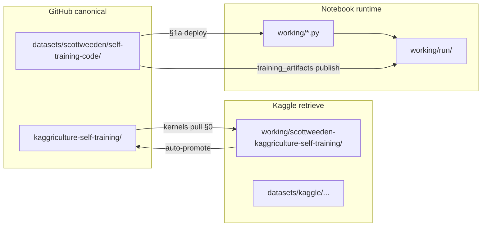

# Kaggriculture — Training home for scottweeden/kaggriculture-self-training

**Repository:** https://github.com/sweeden-ttu/kagg
**Kaggle**:   https://kaggle.com/datasets/scottweeden/self-training-code

This is a reinforcement learning and immitation replay deep learning repository focused on a DQN SB3 Gymnasium dual action state and policy heuristics agent gameplay and training.

Current experiment: 

---

## Directory map

```text
~/kagg/
├── README.md                 ← architecture, limits, inventory (this file)
│
├── eval.py                   ← rubric-aligned head-to-head eval + opponent loader
├── pair_match.py             ← CLI: one challenger vs full opponent ladder
├── run_experiments_eval.py   ← CLI: batch eval across agent bundles
├── run_published_eval.py     ← CLI: download Kaggle champion + pair_match
│
├── opponents/                ← 10 reference ladder agents (tier 0–9)
│   ├── fallow_finn.py        ← tier 0 — reward floor (~3k bank)
│   ├── wheat_walter.py       ← tier 1
│   ├── rotation_rosa.py        ← tier 2
│   ├── homestead_hana.py     ← tier 3
│   ├── melon_mateo.py        ← tier 4 — premium crop baseline
│   ├── rancher_rita.py       ← tier 5 — livestock
│   ├── broker_bea.py         ← tier 6 — meta field plan
│   ├── ledger_lena.py        ← tier 7
│   ├── slotter_silas.py      ← tier 8
│   └── closer_cleo.py        ← tier 9
│
├── kaggriculture-self-training/   ← GitHub-canonical Kaggle kernel (push source)
│   ├── kaggriculture-self-training.ipynb
│   ├── kernel-metadata.json
│   └── input_requirements.txt   ← packagemanager pip install lines
│
├── working/                     ← local mirror of /kaggle/working
│   ├── scottweeden-kaggriculture-self-training/  ← staging after §0 kernels pull
│   ├── *.py                     ← runtime copies from code dataset (§1a)
│   └── run/                     ← experiment output (mirrors training_artifacts)
│
├── .sync/manifest.json          ← hash/mtime manifest (see Sync below)
│
├── scripts/
│   ├── sync_manifest.py         ← scan/report/sync GitHub ↔ Kaggle mirrors
│   └── sync_pairs.json          ← which directory pairs to compare
│
├── datasets/
│   ├── reference/            ← opponent ladder metadata (from Kaggle reference dataset)
│   │   ├── agents_manifest.csv      ← tier order, expected bank, strategy notes
│   │   ├── baseline_league.csv      ← ladder standings
│   │   ├── head_to_head_games.csv   ← precomputed reference matchups
│   │   ├── crop_economics.csv
│   │   ├── price_curves.csv
│   │   └── season_timeline.csv
│   ├── scottweeden/self-training-code/   ← gitignored — downloaded Kaggle model bundle
│   ├── published_eval.json   ← output from run_published_eval.py
│   └── eval_summary.json     ← output from run_experiments_eval.py
│
```
---

## Development environment

Local work uses a **miniforge** conda env named `kagg` (Python 3.12). Packages are installed with **`uv pip`** inside that env — fast resolver, same wheels as pip.

### Stable-Baselines3 dependency stack

SB3 is **PyTorch-only** — it does **not** use TensorFlow. Install PyTorch first, then SB3.

| Layer | Packages | Role |
|---|---|---|
| **Deep learning** | `torch`, `torchvision`, `torchaudio` | Neural nets, GPU/MPS backends |
| **SB3 core** | `gymnasium`, `numpy`, `cloudpickle` | RL env API, arrays, model serialization |
| **SB3 `[extra]`** | `tensorboard`, `pandas`, `matplotlib`, `tqdm`, `rich`, `psutil`, `opencv-python`, `pillow`, `pygame-ce`, `ale-py` | Logging, plots, progress bars, Atari (optional) |
| **Kaggriculture** | `kaggle-environments`, `kagglehub` | Simulation + dataset/kernel downloads |
| **Notebooks** | `jupyter`, `ipykernel` | Local kernel + Kaggle notebook parity |

### One-time setup

```bash
# Create env (miniforge)
conda create -n kagg python=3.12 -y
conda activate kagg

# uv drives all pip installs (pin env when another conda env is active)
conda install -c conda-forge uv -y
KAGG_PY="$(conda info --base)/envs/kagg/bin/python"
uv pip install --python "$KAGG_PY" torch torchvision torchaudio
uv pip install --python "$KAGG_PY" "stable-baselines3[extra]" kaggle-environments kagglehub jupyter ipykernel

# Register Jupyter kernel for notebooks in this repo
python -m ipykernel install --user --name kagg --display-name "Python (kagg)"
```

### Cursor / VS Code

This repo pins the interpreter in `.vscode/settings.json` to:

`/Users/sweeden/miniforge3/envs/kagg/bin/python`

Reload the window after first setup so notebooks and the integrated terminal pick up the `kagg` env automatically.

---

## Kaggle ↔ GitHub sync

Notebook **§0** in [`kaggriculture-self-training/kaggriculture-self-training.ipynb`](kaggriculture-self-training/kaggriculture-self-training.ipynb) pulls the latest kernel from Kaggle into `working/scottweeden-kaggriculture-self-training/`, patches `kernel-metadata.json` with **yesterday's** daily episode dataset slug (if missing — same rule as `DEFAULT_END_DATE` in `episode_catalog.py`), and promotes the ipynb + metadata to `kaggriculture-self-training/` when running locally (`~/kagg`).

Requires `kaggle` CLI credentials. On Kaggle runtime, staging under `/kaggle/working/scottweeden-kaggriculture-self-training/` is authoritative; promote to canonical is skipped when input is read-only.

### Duplicate directories (mirrored pairs)

These paths overlap because of **GitHub checkout**, **Kaggle kernel pull**, and **notebook runtime copies**:

| Role | GitHub / push canonical | Kaggle pull / runtime mirror | Notes |
|------|-------------------------|------------------------------|-------|
| **Training kernel** | `kaggriculture-self-training/` | `working/scottweeden-kaggriculture-self-training/` | ipynb + kernel-metadata for `kaggle kernels push`; §0 staging dir |
| **Code dataset** | `datasets/scottweeden/self-training-code/` | `working/` (top-level `.py` + `kaggriculture_rl/`) | Notebook §1a copies writable modules here each run |
| **RL subpackage** | `datasets/.../kaggriculture_rl/` | `working/kaggriculture_rl/` | `dqn_sb3.py` and `ImitationLearning.ipynb` may differ between copies |
| **Training artifacts** | `datasets/.../training_artifacts/` | `working/run/` | checkpoints, metrics, `agent.py`, plots — diverge after local runs |
| **Adapter copies in run** | `datasets/.../kaggriculture_adapter.py` (read-only source) | `working/run/kaggriculture_adapter.py`, `working/run/kaggriculture_path_b_rebuild.py` | Extra copies written during agent export |
| **Episode cache** | `datasets/kaggle/kaggriculture-episodes-*` | `working/kaggle_episodes/` | metadata merge cache (not a 1:1 hash mirror) |

**Not duplicated:** `opponents/`, `scripts/`, root CLIs (`eval.py`, etc.), `datasets/reference/`.



### Hash manifest (`.sync/manifest.json`)

Config: [`scripts/sync_pairs.json`](scripts/sync_pairs.json). CLI: [`scripts/sync_manifest.py`](scripts/sync_manifest.py).

| Pair | GitHub | Kaggle/working |
|------|--------|----------------|
| `training_kernel` | `kaggriculture-self-training/` | `working/scottweeden-kaggriculture-self-training/` |
| `code_modules` | `datasets/scottweeden/self-training-code/*.py` | `working/*.py` |
| `kaggriculture_rl` | `…/kaggriculture_rl/` | `working/kaggriculture_rl/` |
| `training_artifacts` | `…/training_artifacts/` | `working/run/` |

```bash
python scripts/sync_manifest.py scan
python scripts/sync_manifest.py report
python scripts/sync_manifest.py sync --direction kaggle-to-github --dry-run
python scripts/sync_manifest.py sync --direction github-to-kaggle --dry-run
python scripts/sync_manifest.py sync --direction github-to-kaggle --force github   # resolve conflicts
```

Bulk episode JSONs under `datasets/kaggle/kaggriculture-episodes-*` are not hash-tracked (too large). §0 does **not** call the manifest CLI — run `scan` manually after promote or sync.

---

## ⛔ Do not add more files

`experiments/*` should be the only place submissions are generated and submitted from. There should always be one active experiment and that experiment should be documented below this line:

**Mappings**
1. ~/kagg = /kaggle/input
2. ~/kagg/working = /kaggle/working  & ~/kagg/experiments is player 1
3. ~/kagg/datasets = /kaggle/input/dataset
4. ~/kagg/opponents = adversarial opponents is player 2

---

## Training architecture

### Phase 0 — Imitation replay bootstrap (last 30 days)

The replay buffer is seeded from the **last 30 calendar days** of public Kaggriculture episode JSONs before RL gradients run:

1. Pull daily episode JSONs from the Kaggle corpus.
2. Parse `(obs, action, reward, next_obs, done)` from top-ranked seats.
3. Fill PER buffer — **behavioral cloning priors**, not random rollouts.

### Phase 1 — DQN (SB3-style)

**Dueling Double DQN with action branching**, API aligned with [Stable-Baselines3 DQN](https://stable-baselines3.readthedocs.io/en/master/modules/dqn.html): online + target networks, hierarchical action heads (farmer / crop / hands / market).

### Phase 2 — Self-play + ladder eval

| Seat | Role |
|---|---|
| **Player 0** | Online Path B DQN — learns from replay during self-play |
| **Player 1 (training)** | Frozen **checkpoint pool** (historical selves) |
| **Player 1 (eval)** | Reference agents in `opponents/` — ladder report only |

Self-play optimizes vs the checkpoint pool. **Ladder eval** (after training) measures head-to-head win rate vs every file in `opponents/`; it does not retrain on failure.

Promotion target: win rate ≥ 50% vs **every** opponent in ladder eval.

```text
  Episode JSONs (30d) ──► Imitation buffer ──► BC warm-start
                                                    │
  opponents/*.py ◄──── ladder eval (post-training) ──── trained agent
                                                    │
                                              main.py + model.pth
```


---

## Evaluation

```bash
# One agent dir vs full ladder
python pair_match.py --agent-dir datasets/scottweeden/self-training-code

# Download Kaggle champion + eval
python run_published_eval.py --n-episodes 20
```

Or native Kaggle:

```python
from kaggle_environments import evaluate
from pathlib import Path

for opp in sorted(Path("opponents").glob("*.py")):
    r = evaluate("kaggriculture", ["main.py", str(opp)], num_episodes=20)
    print(opp.stem, sum(1 for x in r if x[0] > x[1]), len(r))
```

Win/loss/tie: higher final bank wins ([Kaggle rubric](https://www.kaggle.com/competitions/kaggriculture/overview/evaluation)).

---

## Hard limits (full tree)

| Artifact | Limit |
|---|---|
| **Python at repo root** | **≤ 10** (currently **4** — room for 6 training modules) |
| **`opponents/*.py`** | reference roster only — **not** counted in the 10 |
| **Notebooks** | **1** → `kernels/train.ipynb` |
| **Submission** | **1** `main.py` with `agent(obs, configuration)` |
| **Config / weights** | **1** `config.json`, **1** `model.pth`, **1** `bootstrap_model.pth` |

---

## Legacy source

Copied from: `~/kaggle-leaderboard-notebooks/challenges/kaggriculture/`  
Do not sync experiments or scripts back from legacy without explicit merge into the file budget above.

See [TODO.md](TODO.md) for the notebook fix tracker.

